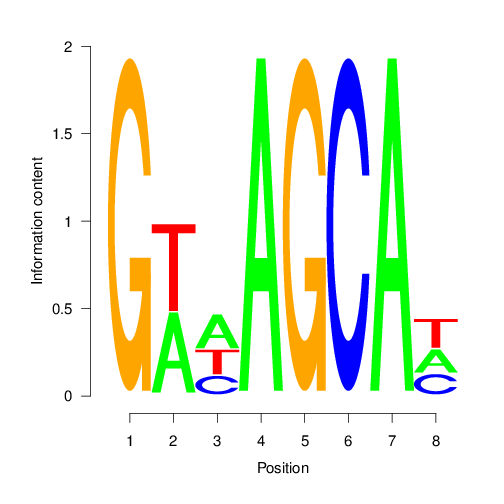

## Parse DNA sequences of peak regions from genome

Enrichment analysis of known DNA binding motifs or _de novo_ discovery
of novel motifs requires the DNA sequences of the identified peak
regions. To parse the corresponding sequences from the reference genome,
the `getSeq` function from the `Biostrings` package can be used. The 
following example parses the sequences for each peak set and saves the 
results to separate FASTA files, one for each peak set. In addition, the 
sequences in the FASTA files are ranked (sorted) by increasing p-values 
as expected by some motif discovery tools, such as `BCRANK`.


library(Biostrings); library(seqLogo); library(BCRANK)
args <- systemArgs(sysma="param/annotate_peaks.param", mytargets="targets_macs.txt")
rangefiles <- infile1(args)
for(i in seq(along=rangefiles)) {
    df <- read.delim(rangefiles[i], comment="#")
    peaks <- as(df, "GRanges")
    names(peaks) <- paste0(as.character(seqnames(peaks)), "_", start(peaks), "-", end(peaks))
    peaks <- peaks[order(values(peaks)$X.log10.pvalue, decreasing=TRUE)]
    pseq <- getSeq(FaFile("./data/tair10.fasta"), peaks)
    names(pseq) <- names(peaks)
    writeXStringSet(pseq, paste0(rangefiles[i], ".fasta")) 
}


## Motif discovery with `BCRANK`

The Bioconductor package `BCRANK` is one of the many tools available for 
_de novo_ discovery of DNA binding motifs in peak regions of ChIP-Seq
experiments. The given example applies this method on the first peak
sample set and plots the sequence logo of the highest ranking motif.


set.seed(0)
BCRANKout <- bcrank(paste0(rangefiles[1], ".fasta"), restarts=25, use.P1=TRUE, use.P2=TRUE)
toptable(BCRANKout)
topMotif <- toptable(BCRANKout, 1)
weightMatrix <- pwm(topMotif, normalize = FALSE)
weightMatrixNormalized <- pwm(topMotif, normalize = TRUE)
pdf("results/seqlogo.pdf")
seqLogo(weightMatrixNormalized)
dev.off()


Figure 2: One of the motifs identified by `BCRANK`

